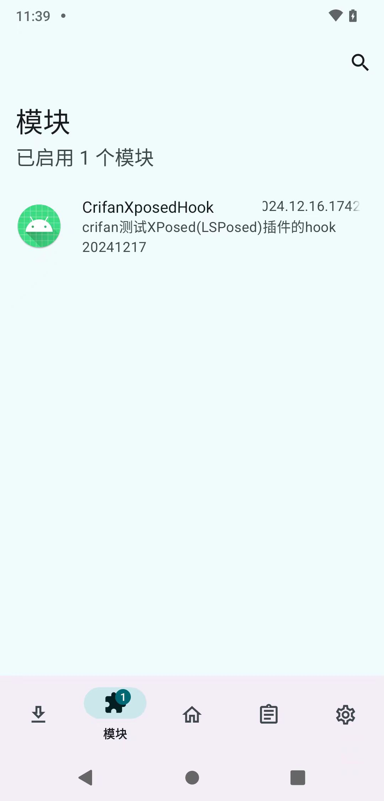
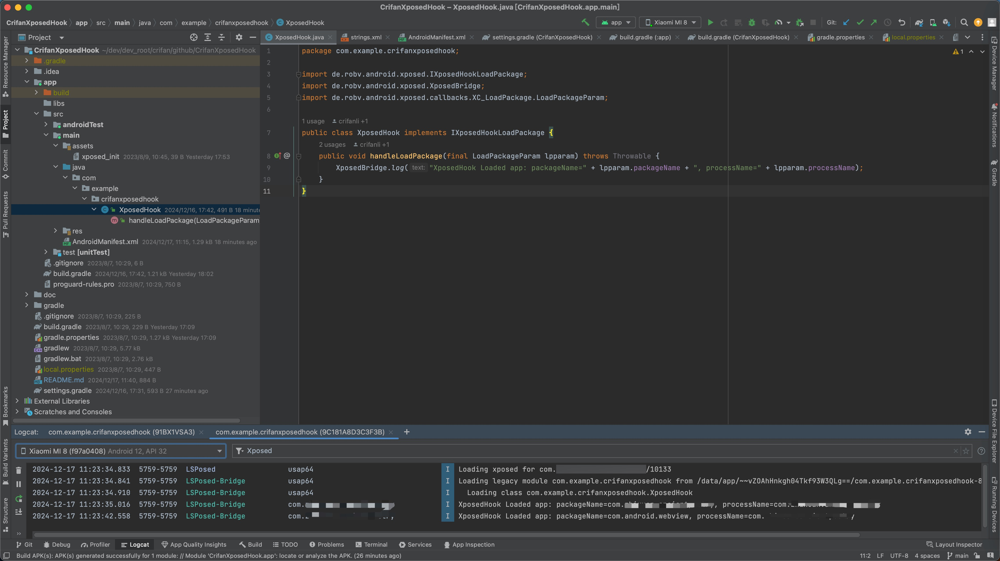

# CrifanXposedHook

最后更新：`20241217`

## 代码仓库

https://github.com/crifan/CrifanXposedHook

https://github.com/crifan/CrifanXposedHook.git

## 项目功能

Xposed插件demo演示项目，Android Studio项目代码

## 代码解释

详见教程：

[Xposed插件开发 · 强大的安卓破解辅助工具：XPosed框架 (crifan.org)](https://book.crifan.org/books/crack_assistant_xposed_framework/website/dev_xposed_plugin/)

## 效果

* EdXposed
  * EdXposed中能查看到Xposed模块
    * 
  * 从EdXposed的日志中能查看到Hook代码的log日志
    * 
* LSPosed
  * LSPosed中能查看到Xposed模块
    * 
  * Xposed插件生效：AndroidStudio中Logcat中log日志中可以看到hook的log
    * 

